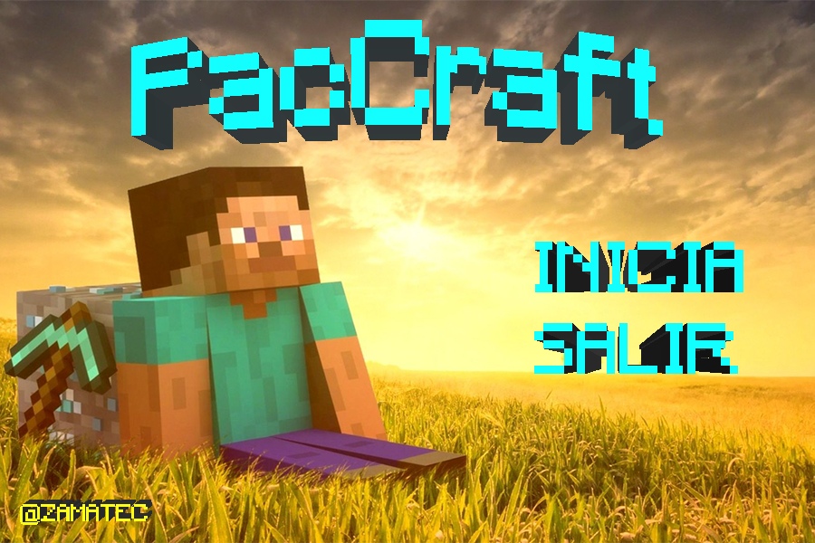
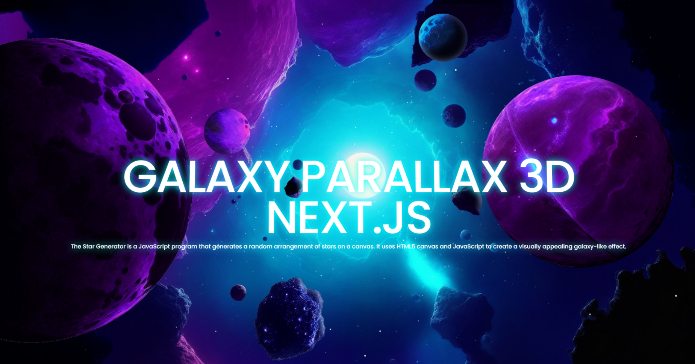
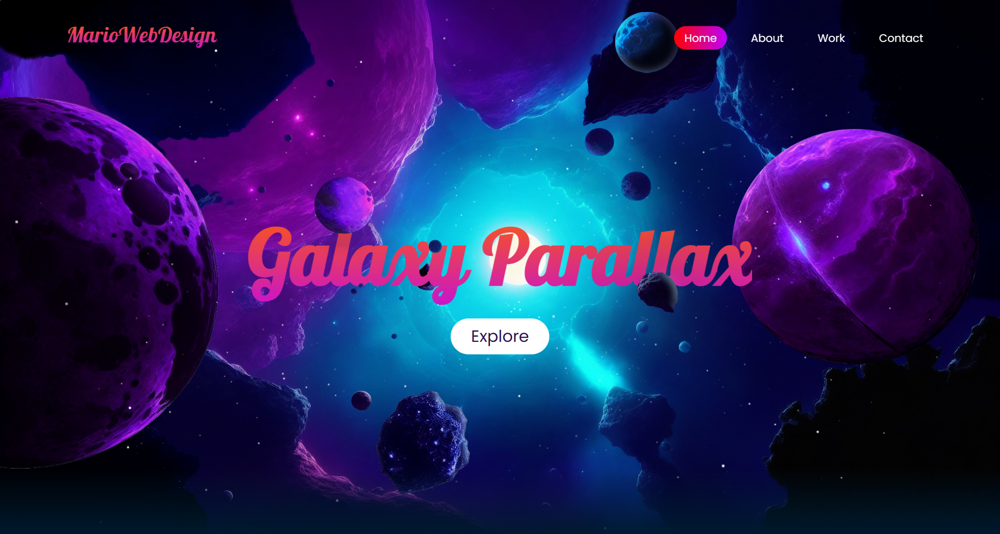
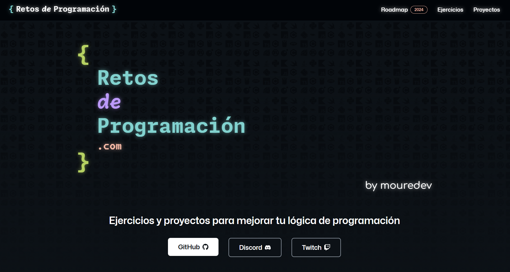
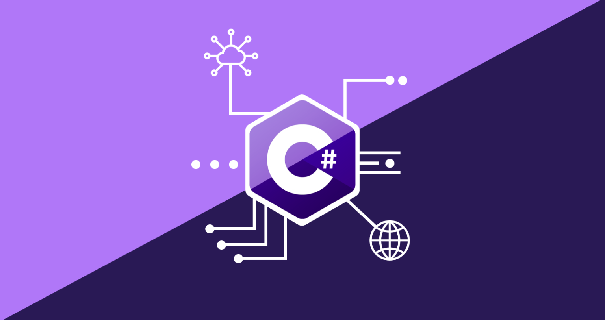
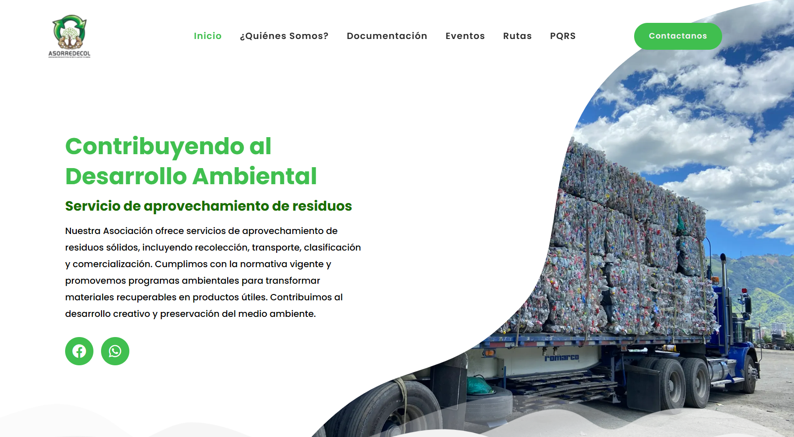
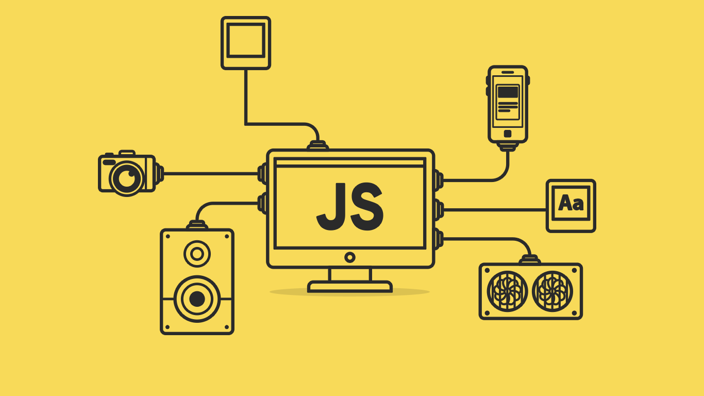
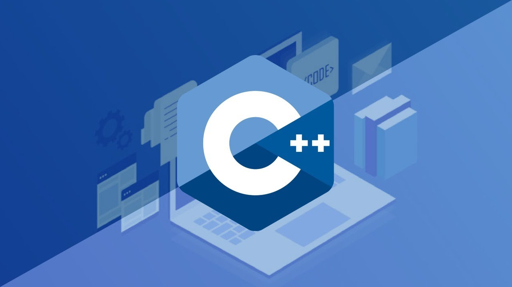
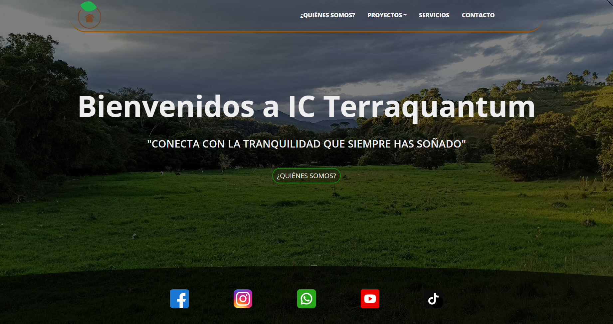
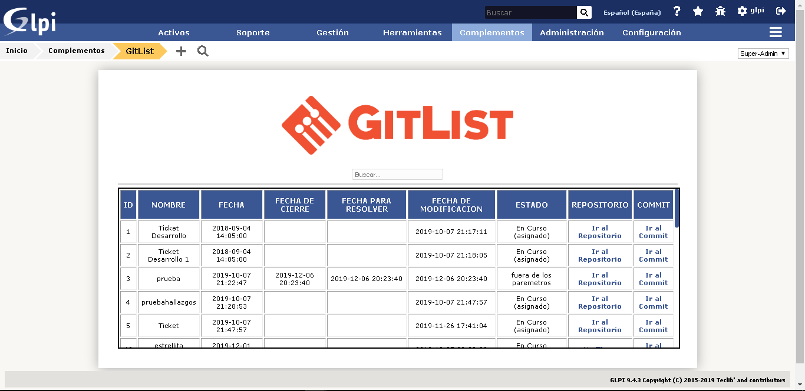

    
    
  
  

# 👋 Hola, soy Mario Hernandez

## 👨‍💻 Desarrollador Web Full-Stack y Estudiante Desarrollador Mobile Full-Stack

¡Bienvenido a mi perfil de GitHub! Soy un apasionado desarrollador web FullStak con experiencia en diversas tecnologías. Actualmente, también estoy inmerso en el emocionante mundo del desarrollo Mobile Full-Stack, ampliando mis habilidades para crear aplicaciones intuitivas y de alto rendimiento. Aquí encontrarás algunos de los proyectos en los que he trabajado y las habilidades que he adquirido a lo largo de mi carrera.

## 🎓 Títulos:

- ### Técnico en Desarrollo de Software
- ### Estudiante de Tecnología Desarrollo de Software

## 💻 Tecnología de Desarrollo de Software:

 
  
  
  
  
  
  
  
  
  
  
  
  
  
   

<!-- 

 

 

 -->

## 🎨 Programas de Diseño:

 
  
  
  
  
  
  
  
  
  
 

<!-- 

 

 

 -->

## 👨‍💻 Lenguajes de Programación:

 
  
  
  
  
  
  
  
  
  
  
  
   

<!-- 

 

 -->

## 🗄️ Programas de Base de Datos:

 
  
  
  
  
  
   

## 👨‍💻 Estudiando:

 
  
  
  
  
  
  
  
  
  
  
  
  
   

<!-- 

 -->

## 📚 Repositorios de interés:

### Aquí tienes algunos de mis repositorios que podrían interesarte:

<table style="width:100%">
 
    <tr>
        <td>            
            
        </td>
        <td>            
            
        </td>
    </tr>
    <tr>
        <td>            
            
        </td>
        <td>            
            
        </td>
    </tr>
    <tr>
        <td>        
            
        </td>
        <td>
            
        </td>
    </tr>
    <tr>
        <td>          
            
        </td>
        <td>
            
        </td>
    </tr>
    <tr>
        <td>
            
        </td>
        <td>            
            
        </td>
    </tr>
    <tr>
        <td>            
            
        </td>
        <td>            
            
        </td>
    </tr>
    <tr>
        <td>            
            
        </td>
        <td>            
            
        </td>
    </tr>
    <tr>
        <td>            
            
        </td>
        <td>            
            
        </td>
    </tr>
</table>

## 🙏 ¡Gracias por visitar mi perfil de GitHub! 🙌

Espero que encuentres interesantes mis proyectos y que podamos colaborar en el futuro. Si tienes alguna pregunta o sugerencia, no dudes en contactarme.

¡Gracias nuevamente y que tengas una excelente experiencia escribiendo código! 😊
