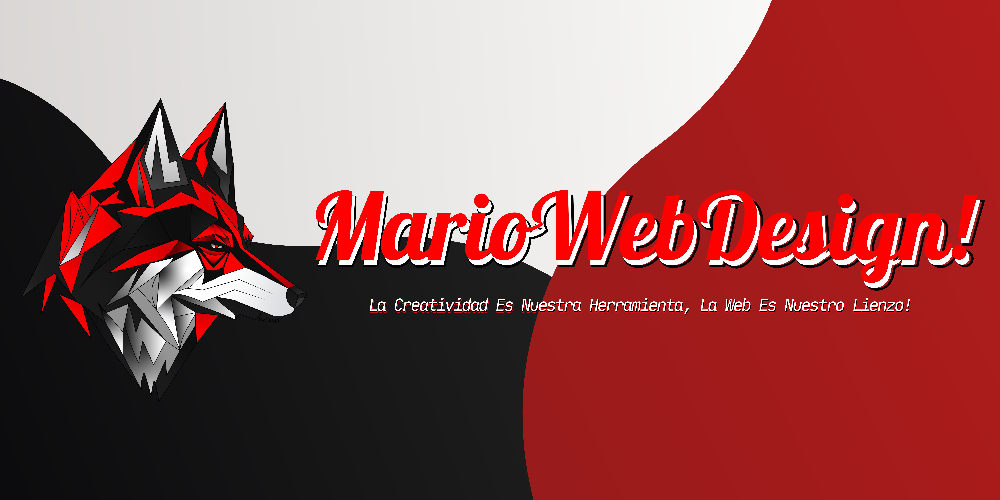
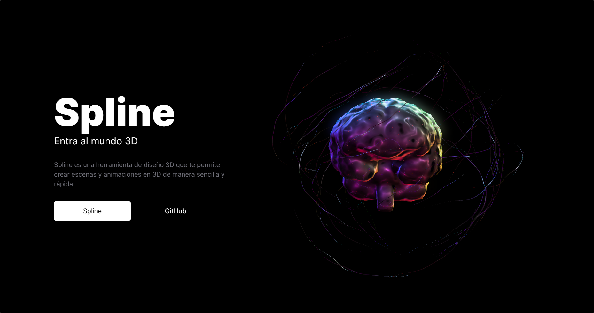

# 👋 Hola, soy Mario Hernandez

¡Bienvenido a mi perfil de GitHub! Soy un desarrollador web Full Stack con amplia experiencia en diversas tecnologías, apasionado por crear soluciones web innovadoras y funcionales.

## 🎓 Títulos:

- Técnico en Desarrollo de Software
- Estudiante de Tecnología Desarrollo de Software

## 💻 Tecnología de Desarrollo de Software:

 
  
  
  
  
  
  
  
  
  
  
  
  
  
   

## 🎨 Programas de Diseño:

 
  
  
  
  
  
  
  
  
  
 

## 👨‍💻 Lenguajes de Programación:

 
  
  
  
  
  
  
  
  
  
  
  
   

## 🗄️ Programas de Base de Datos:

 
  
  
  
  
  
   

## 👨‍💻 Estudiando:

 
  
  
  
  
  
  
  
  
  
  
  
   

## 📚 Repositorios de interés:

Aquí tienes algunos de mis repositorios que podrían interesarte:

<table style="width:100%">
 
    <tr>
        <td>            
            
        </td>
        <td>            
            
        </td>
    </tr>
    <tr>
        <td>            
            
        </td>
        <td>            
            
        </td>
    </tr>
    <tr>
        <td>        
            
        </td>
        <td>
            
        </td>
    </tr>
    <tr>
        <td>          
            
        </td>
        <td>
            
        </td>
    </tr>
    <tr>
        <td>
            
        </td>
        <td>            
            
        </td>
    </tr>
    <tr>
        <td>            
            
        </td>
        <td>            
            
        </td>
    </tr>
    <tr>
        <td>            
            
        </td>
        <td>            
            
        </td>
    </tr>
    <tr>
        <td>            
            
        </td>
        <td>            
            
        </td>
    </tr>
</table>

## Estadisticas

    
    
     
    

## 🙏 ¡Gracias por visitar mi perfil de GitHub! 🙌

Espero que encuentres interesantes mis proyectos y que podamos colaborar en el futuro. Si tienes alguna pregunta o sugerencia, no dudes en contactarme.

¡Gracias nuevamente y que tengas una excelente experiencia escribiendo código! 😊

