[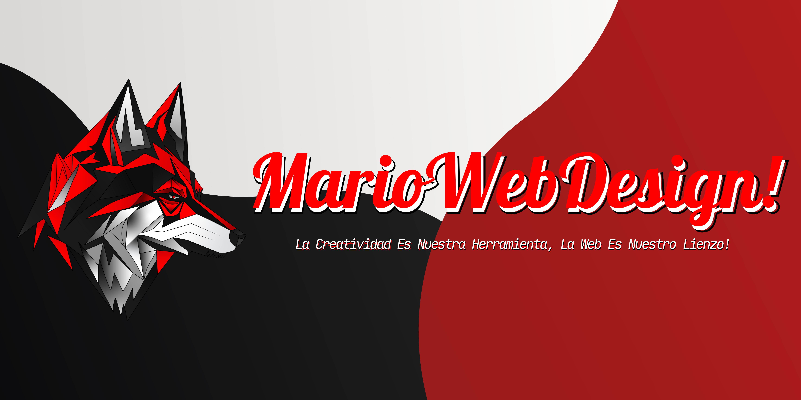](https://mariowebdesign.vercel.app/)

 

 

# 👋 Hola, soy [Mario Hernandez](https://mariowebdesign.vercel.app/)

¡Bienvenido a mi perfil de GitHub! Soy un apasionado del diseño y desarrollo web, me encanta crear sitios web y aplicaciones web que sean atractivas, funcionales y accesibles para todos. Me especializo en el desarrollo de sitios web y aplicaciones web utilizando tecnologías modernas como HTML5, CSS3, JavaScript, React, Node.js, MongoDB, entre otras.

## 🎓 Títulos:

- Técnico en Desarrollo de Software
- Estudiante de Ingeniería de Software

## 👨‍💻 Front-End:

 
  
  
  
  
  
  
  
  
  
  
  
  
  
   

## ⚙️ Back-End:

 
  
  
  
  
  
  
  
  
  
  
  
   

## 🎨 Diseño:

 
  
  
  
  
  
  
  
  
  
 

## 🗄️ Base de Datos:

 
  
  
  
  
  
  
  
   

## � Tecnología de Desarrollo de Software:

 
  
  
  
  
  
  
  
  
  
  
  
  
  
   

## 📚 Repositorios de interés:

Aquí tienes algunos de mis repositorios que podrían interesarte:

<table style="width:100%">
 
    <tr>
        <td>            
            <a href="https://github.com/Marioalf2002/PacCraft">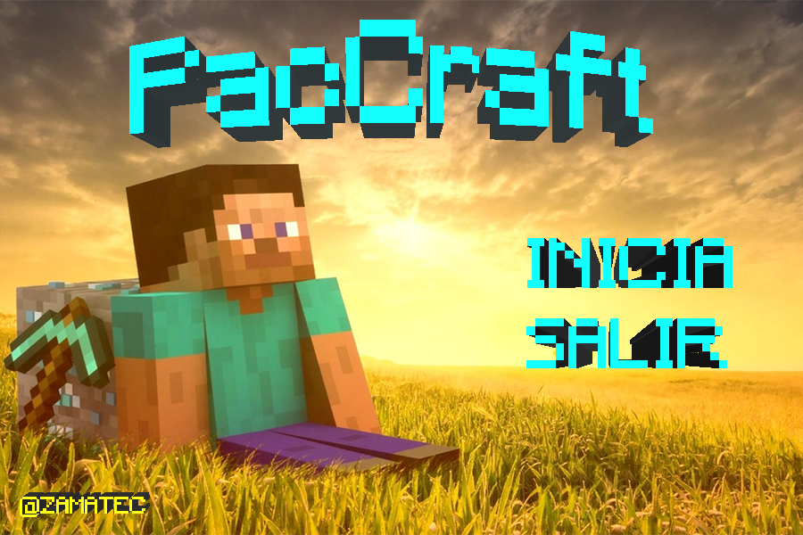</a>
        </td>
        <td>            
            
        </td>
    </tr>
    <tr>
        <td>            
            <a href="https://github.com/Marioalf2002/spline">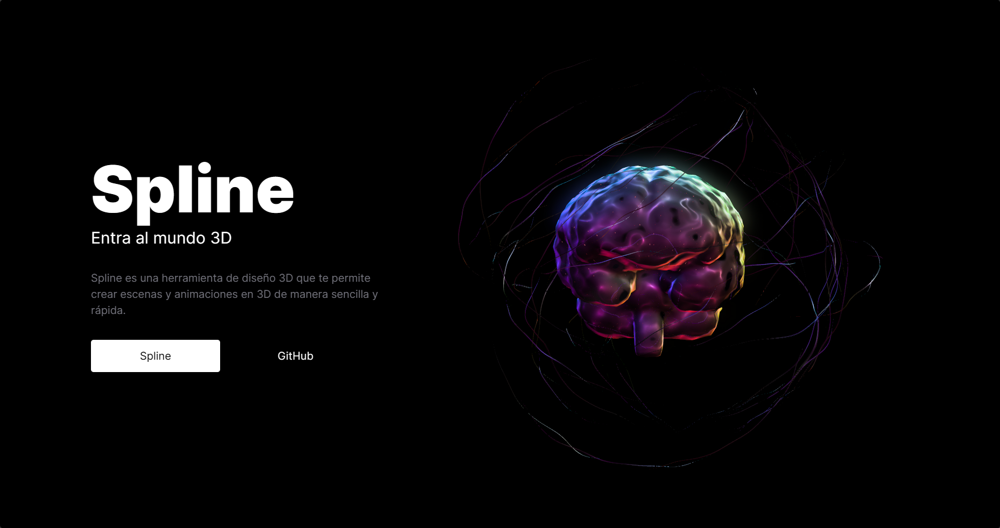</a>
        </td>
        <td>            
            <a href="https://github.com/Marioalf2002/galaxy-parallax">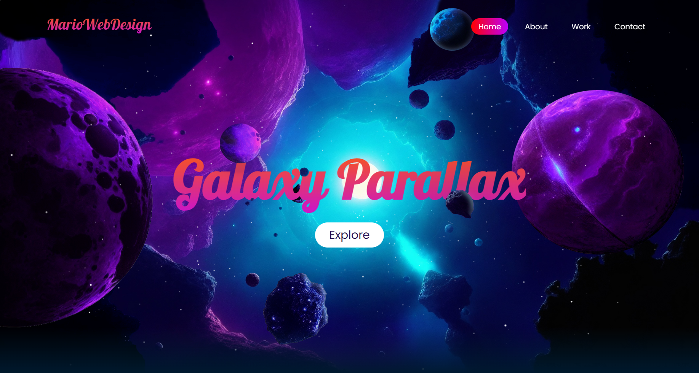</a>
        </td>
    </tr>
    <tr>
        <td>        
            
        </td>
        <td>
            <a href="https://github.com/Marioalf2002/MedellinEcologicoWeb">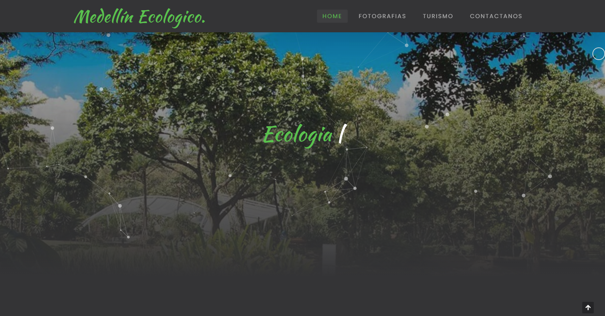</a>
        </td>
    </tr>
    <tr>
        <td>          
            <a href="https://github.com/Marioalf2002/eCommerce">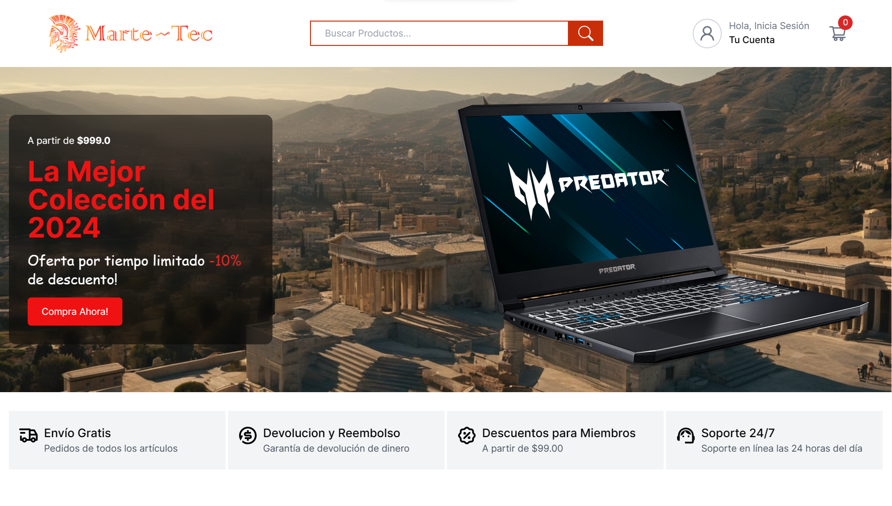</a>
        </td>
        <td>
            <a href="https://github.com/Marioalf2002/RetosProgramacion">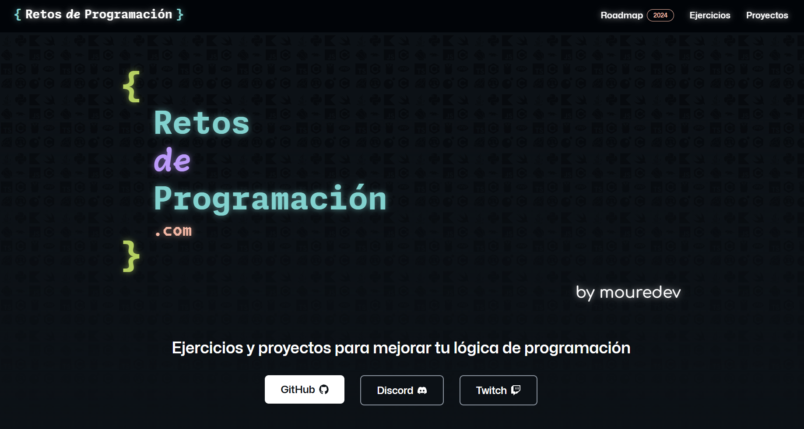</a>
        </td>
    </tr>
    <tr>
        <td>
            <a href="https://github.com/Marioalf2002/Estudio_C_Sharp">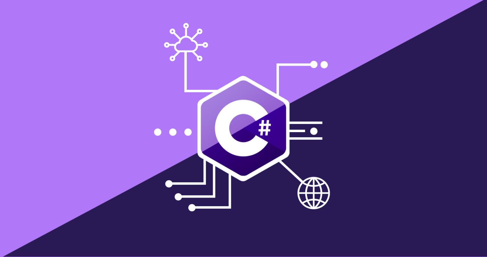</a>
        </td>
        <td>            
            <a href="https://asociacionasorredecol.com/">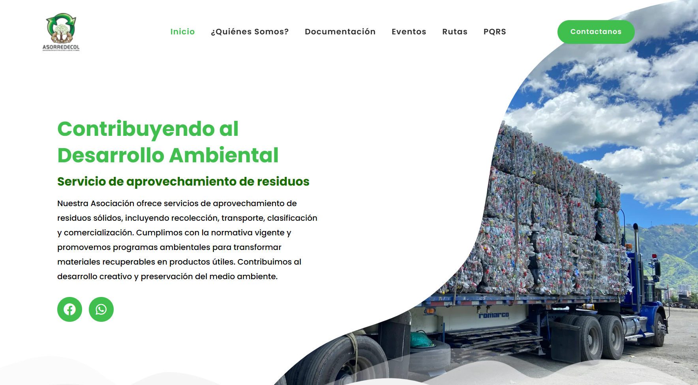</a>
        </td>
    </tr>
    <tr>
        <td>            
            <a href="https://estructurarteconstrucciones.com/">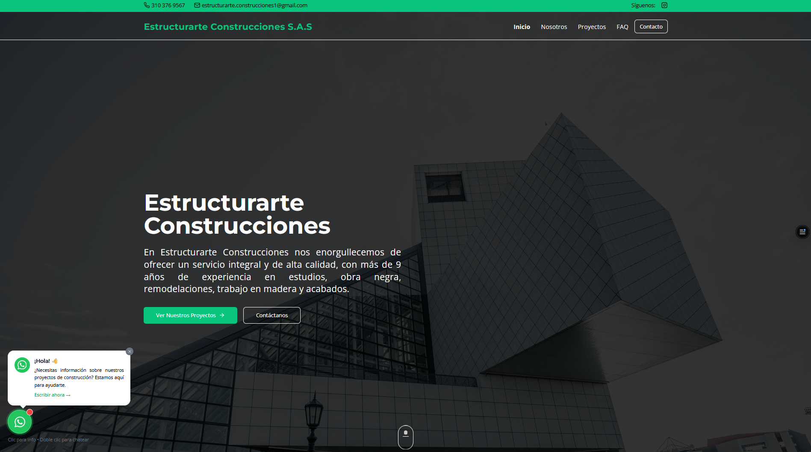</a>
        </td>
        <td>            
            <a href="https://arkanexo.com/">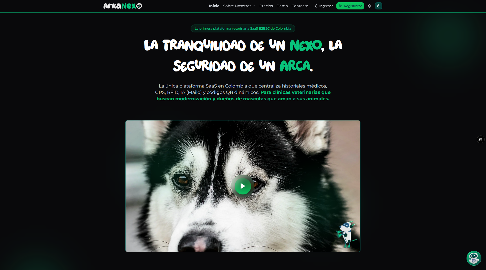</a>
        </td>
    </tr>
    <tr>
        <td>            
            <a href="https://github.com/Marioalf2002/CursoJavaScript">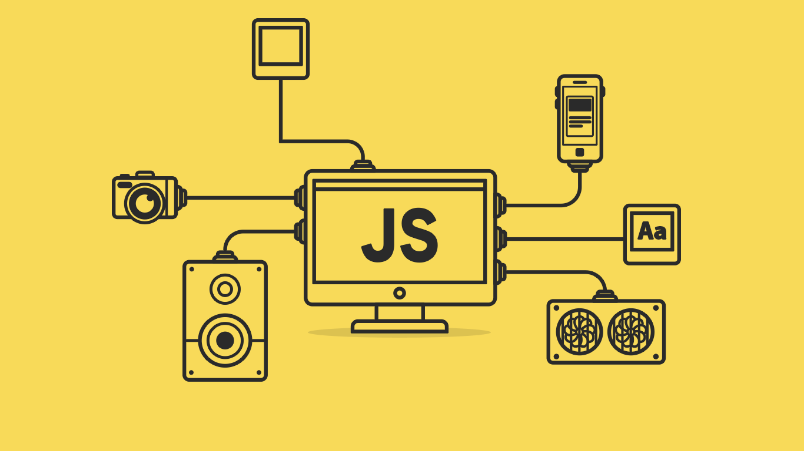</a>
        </td>
        <td>            
            <a href="https://github.com/Marioalf2002/EstudioC">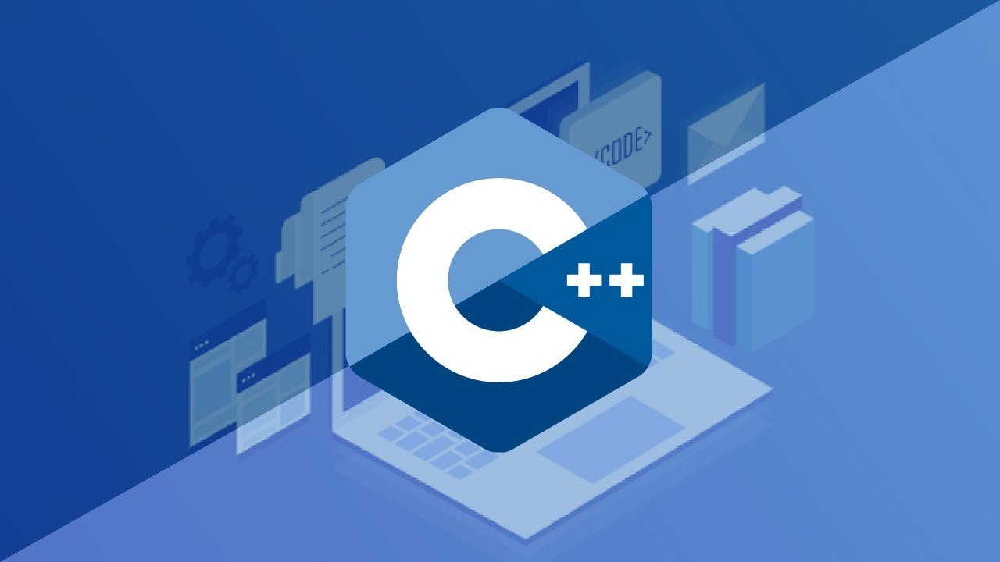</a>
        </td>
    </tr>
    <tr>
        <td>            
            <a href="https://github.com/Marioalf2002/IC-Terraquantum">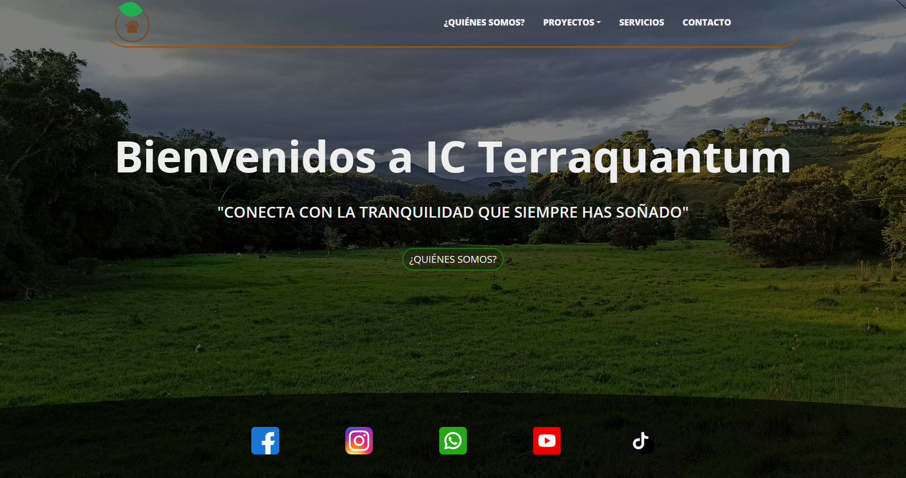</a>
        </td>
        <td>            
            <a href="https://github.com/Marioalf2002/GitList-Plugin-Glpi">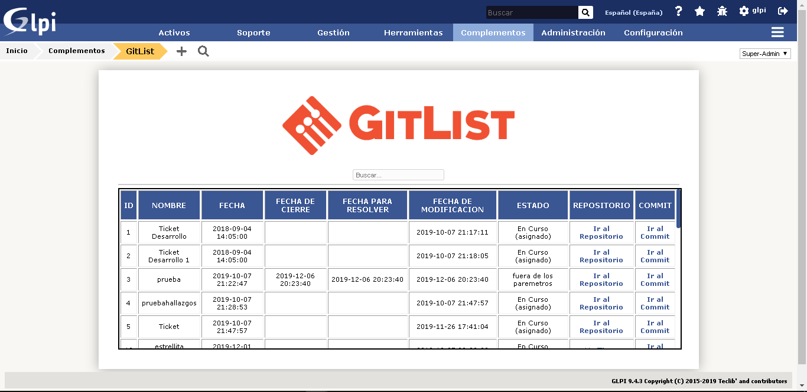</a>
        </td>
    </tr>
    <tr>
        <td>            
            
        </td>
        <td>            
            <a href="https://github.com/Marioalf2002/CursoPHPMySql">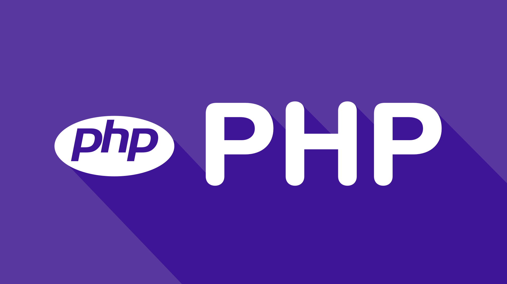</a>
        </td>
    </tr>
</table>

## Estadisticas

    
    
    
     
    

## 🙏 ¡Gracias por visitar mi perfil de GitHub! 🙌

Espero que encuentres interesantes mis proyectos y que podamos colaborar en el futuro. Si tienes alguna pregunta o sugerencia, no dudes en contactarme.

¡Gracias nuevamente y que tengas una excelente experiencia escribiendo código! 😊
